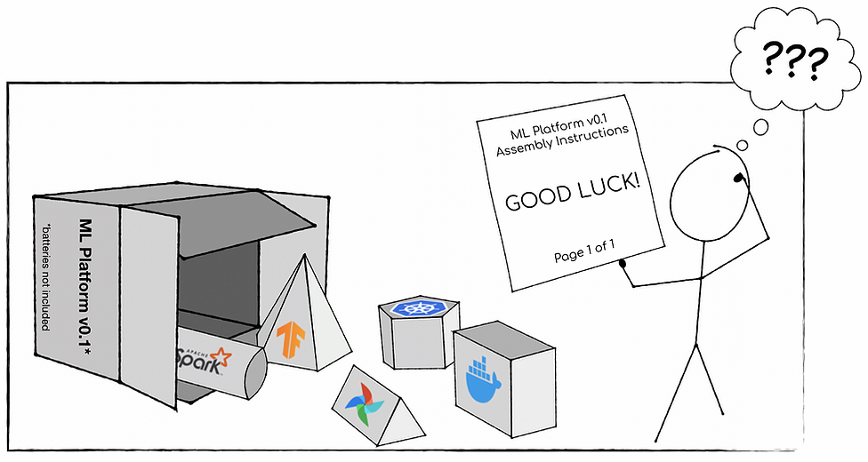

# Easy MLOps Stacks

Sophisticated teams develop their MLOps stack from a combination of best of breed components.

But building or spinning up stacks is incredibly difficult.

This open source community exists to make combining them less of a headache.

Deploy common MLOps stacks with a single command.

<figure>
  
  <figcaption><small>Credit: <a href="https://towardsdatascience.com/the-problem-with-ai-developer-tools-for-enterprises-and-what-ikea-has-to-do-with-it-b26277841661">Clemens Mewald</a></small></figcaption>
</figure>

## How It Works

Combinator.ml makes it easy to test drive, combine & deploy the stack that's best for you.

### Components, Stacks and Infrastructure

Combinator components are infinitely composible ML products. We present a curated combination of components as stacks, although it is easy to develop your own bespoke stack. Infrastructure abstractions make it easy to deploy components and stacks. [Find out more.](design.md)

### { width=200 }

Terraform is the common language we use to combine stacks. Don't worry if you're not familiar with it, we make it easy to get started with it.

You can test drive (with the help of [TestFaster](https://testfaster.ci)), spin up a local dev environment, or deploy to a cloud of your choice.

### { width=200 }

Every component is published as a terraform module in an open source GitHub repo.

Each stack is a terraform module too, which references the terraform modules of the components.

We need your help to maintain these! Please contribute to the existing components or stacks, or create your own. [Find out more.](CONTRIBUTING.md)

## MLOps Categories

Components typically fall into one ore more of the following MLOps catagories. [Find out more.](components/introduction.md)

| Category       | Description | |
| ----------     | ----------- | |
| **Data**       | Store, manage, and move data. | [**Explore**](components/introduction.md#data) |
| **Develop**   | Develop and train models | [**Explore**](components/introduction.md#develop) |
| **Deploy** | Deploy models to extract value. | [**Explore**](components/introduction.md#deploy) |
| **Monitor** | Understand the behavior of your models | [**Explore**](components/introduction.md#monitor) |
| **Govern** | Manage, control, and audit your models. | [**Explore**](components/introduction.md#govern) |

## Featured Stacks

Stacks are oppinionated combinations of components. [Find out more.](stacks/introduction.md)

Here are a few examples:

!!! abstract inline "Kubeflow + MLflow"
    *By combinator.ml*

    Kubeflow provides orchestration for notebooks, pipelines, and serving. This stack adds MLflow for model management and makes it easy to log models to MLflow from kubeflow notebooks and pipelines.

    [**View**](stacks/kubeflow-mlflow.md){ .md-button }

!!! abstract inline "Minio + Pachyderm"
    *By combinator.ml*

    Minio is an S3-compatible cloud-native data store. A Pachyderm cluster provides data lineage and pipelines. This stack makes it easy to spin up a cloud-native versioned controlled data store and pipelining tool.

    [**View**](stacks/minio-pachyderm.md){ .md-button }

## Getting Started

It's really easy to get started.

1. [Install Terraform](https://learn.hashicorp.com/tutorials/terraform/install-cli)
2. Browse to a [stack](stacks/introduction.md) or [component](components/introduction.md) and follow the instructions to deploy.

## Get involved!

Find us in `#mlops-stacks` on the MLOps.community Slack:

[Join Slack :rocket:](https://go.mlops.community/slack){ .md-button .md-button--primary }

Or [read more about contributing](CONTRIBUTING.md).

## Community Founders

* [Luke Marsden](https://www.linkedin.com/in/luke-marsden-71b3789/) - MLOps Consulting
* [Kai Davenport](https://www.linkedin.com/in/kai-davenport-228b6017/) - MLOps Consulting
* [Phil Winder](https://www.linkedin.com/in/drphilwinder/) - [Winder Research](https://WinderResearch.com)
* [Demetrios Brinkmann](https://www.linkedin.com/in/dpbrinkm/) - [MLOps Community](https://mlops.community)
